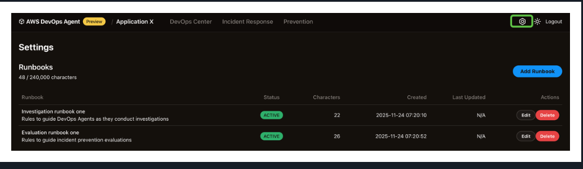

# 1. Overview

## 1.1 Background

Explain why DevOps Agent is important in modern cloud environments.

## 1.2 What is a DevOps Agent?

AWS DevOps Agent is a frontier agent that resolves and proactively prevents incidents, continuously improving reliability and performance.

## 1.3 Key Capabilities

### Always-on, autonomous incident response
AWS DevOps Agent autonomously investigates issues the moment they occur:

- Automated incident investigation – Begins investigating immediately when an alert or support ticket comes in
- Interactive investigation chat – Initiate and guide investigations using natural language in the Dev Op Agent Space web app
- Detailed mitigation plans – Provides specific actions to resolve incidents, validate success, and revert changes if needed
- Automated incident coordination – Routes observations, findings, and mitigation steps through your preferred communication channels like Slack and ServiceNow
- AWS Support integration – Create AWS Support cases directly from an investigation with immediate context provided to AWS Support experts

## 1.4 Benefits 

- Reduce mean time to resolution (MTTR) – Autonomous investigation starts immediately, accelerating incident resolution from hours to minutes
- Prevent recurring incidents – Targeted recommendations address root causes and strengthen system resilience
- Improve operational efficiency – Free your team from repetitive investigation tasks to focus on innovation
- Work within existing workflows – Integrates with your existing tools and processes without disruption

## 1.5 Scope

This documentation focuses on implementation within AWS environment.